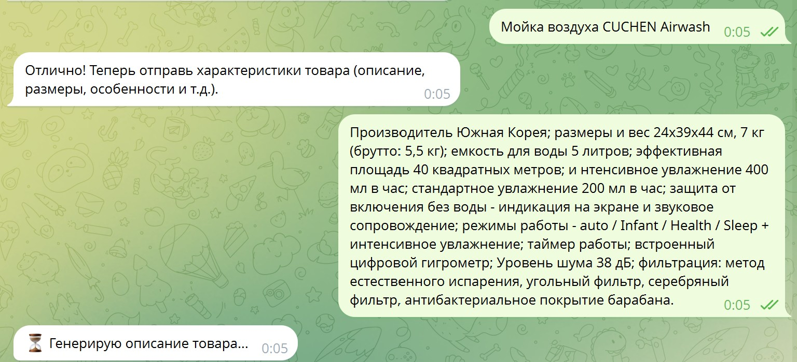
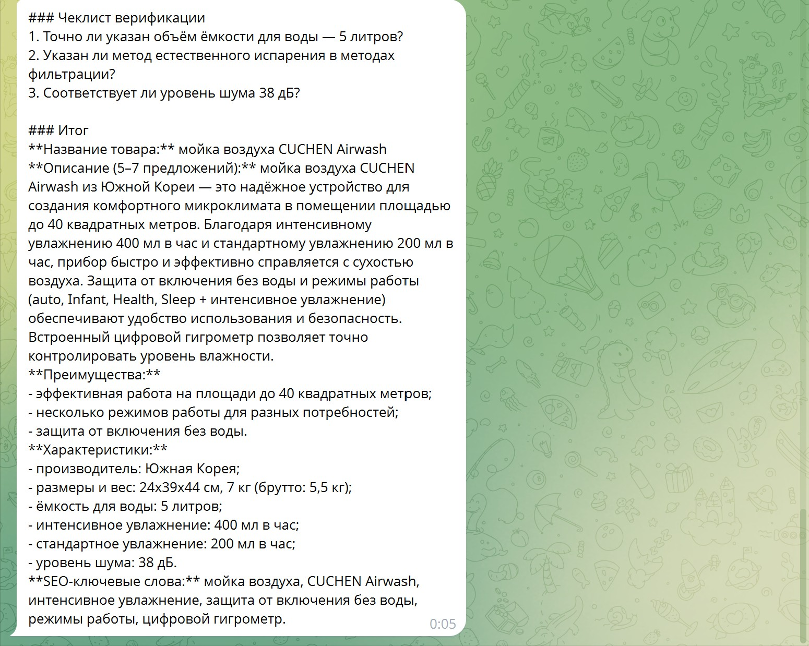

# AI E-commerce Copywriter с архитектурой Chain-of-Verification


## Описание бизнес-задачи

Проект решает критическую проблему e-commerce: **автоматизация создания качественного контента для маркетплейсов** (Ozon, Wildberries) с минимизацией ошибок генеративных моделей.

**Бизнес-ценность:**
- Сокращение времени на создание описаний товаров с 15-20 минут до 30 секунд
- Снижение количества фактологических ошибок через внедрение Chain-of-Verification
- Масштабируемость: обработка сотен товаров без деградации качества
- Соответствие требованиям маркетплейсов: структурированный формат с SEO-оптимизацией

**Проблема, которую решаем:** Стандартные LLM часто генерируют неточные характеристики товаров (неверные размеры, отсутствующие функции), что приводит к возвратам и негативным отзывам. Chain-of-Verification архитектура обеспечивает самопроверку модели перед финальным выводом.

---

## Технологический стек

| Компонент | Технология | Назначение |
|-----------|------------|------------|
| **Backend** | Python 3.11 | Основной язык разработки |
| **Telegram API** | python-telegram-bot 20.0+ | Асинхронный фреймворк для Telegram-бота |
| **LLM** | Yandex GPT API | Генеративная модель для создания контента |
| **Monitoring** | Langfuse 2.0+ | Трекинг качества генерации, визуализация traces |
| **Config** | python-dotenv | Управление переменными окружения |
| **HTTP Client** | requests | Взаимодействие с Yandex GPT API |

**Архитектурные решения:**
- Асинхронная обработка сообщений через `python-telegram-bot`
- State management для многошагового диалога (название → характеристики → генерация)
- Инструментация всех LLM-вызовов через Langfuse для production-мониторинга

---

## Глубокий анализ Prompt Engineering: Chain-of-Verification

### Архитектура CoV в проекте

В системном промпте реализован **Chain-of-Verification (CoV)** — метод, который заставляет модель самостоятельно верифицировать свой ответ перед финальным выводом. Это критично для e-commerce, где ошибки в характеристиках товаров приводят к финансовым потерям.

### Трехэтапный процесс верификации

#### Этап 1: Генерация базового ответа
Модель создает первичный вариант описания товара на основе:
- Названия товара
- Входных характеристик от пользователя
- Требований к структуре (название, описание, преимущества, характеристики, SEO-ключевые слова)

#### Этап 2: Верификация (самопроверка)
**Ключевая инновация:** Модель генерирует до 3 проверочных вопросов к своему собственному ответу и отвечает на них, сверяясь с исходными данными.

**Примеры верификационных вопросов из промпта:**
- "Точно ли указанный объем емкости для воды 5 литров?"
- "Упомянут ли метод естественного испарения в методах фильтрации?"

**Механизм:** Модель сравнивает факты из базового ответа с исходными характеристиками товара, выявляя несоответствия.

#### Этап 3: Создание финального ответа
На основе результатов верификации модель:
- Исправляет выявленные ошибки
- Улучшает формулировки
- Формирует структурированный вывод с чеклистом верификации

### Реализация в коде

```python
system_prompt = """...
Инструкция:
Выполни задачу в соответствии с подходом Chain-of-Verification:

Этап 1: Генерация базового ответа.

Этап 2: Верификация.
Чтобы проверить факты из базового ответа сгенерируй до 3 проверочных вопросов 
и ответь на каждый из них, сравнивая их с исходными данными о продукте.

Этап 3: Создание финального ответа.
На основе результатов верификации отредактируй и улучши базовый ответ.
..."""
```

**Параметры генерации:**
- `temperature: 0.3` — низкая температура для детерминированности и точности фактов
- `maxTokens: 6000` — достаточный контекст для полного CoV-цикла
- `stream: False` — синхронная генерация для целостности верификации

### Преимущества подхода

1. **Снижение галлюцинаций:** Модель проверяет факты перед выводом
2. **Прозрачность:** Чеклист верификации виден в ответе
3. **Адаптивность:** Модель сама определяет, какие аспекты требуют проверки

---

## Monitoring: Интеграция с Langfuse

### Архитектура мониторинга

Проект использует **Langfuse** для production-grade мониторинга LLM-приложений. Это критично для отслеживания качества генерации в реальном времени.

### Инструментация вызовов

**Двухуровневое логирование:**

1. **Span: `yandex_call`** — отслеживает HTTP-запрос к Yandex GPT API
   ```python
   with langfuse.start_as_current_observation(as_type="span", name="yandex_call") as span:
       span.update(input={"payload": payload})
       result = call_yandex(payload)
       span.update(output={"response": result})
   ```

2. **Span: `yandex_bot_call`** — отслеживает полный цикл обработки пользовательского запроса
   ```python
   with langfuse.start_as_current_observation(as_type="span", name="yandex_bot_call") as span:
       span.update(input={"user_text": user_text})
       result = call_yandex(payload)
       span.update(output={"response": result})
   ```

### Возможности мониторинга

- **Traces (цепочки вызовов):** Визуализация полного пути запроса от пользователя до ответа модели
- **Latency tracking:** Измерение времени генерации для оптимизации
- **Input/Output logging:** Сохранение всех входных данных и ответов для анализа качества
- **Error tracking:** Автоматическое логирование исключений
- **Sample rate: 1.0** — 100% покрытие для production-анализа

### Практическое применение

- **A/B тестирование промптов:** Сравнение качества разных версий системного промпта
- **Анализ ошибок:** Выявление паттернов в некорректных генерациях
- **Cost optimization:** Отслеживание токенов для управления бюджетом API

---

## Инструкция по запуску

### Предварительные требования

- Python 3.11+
- Аккаунт Yandex Cloud с доступом к Yandex GPT API
- Telegram Bot Token (получить у [@BotFather](https://t.me/BotFather))
- Langfuse аккаунт (опционально, для мониторинга)

### Установка зависимостей

```bash
# Клонирование репозитория
git clone https://github.com/zuzinamd-creator/Product-copywriter-Yandex-GPT-Telegram_bot-.git
cd Product-copywriter-Yandex-GPT-Telegram_bot-

# Установка зависимостей
pip install -r requirements.txt
```

### Настройка переменных окружения

1. Скопируйте файл `.env.example` в `.env`:
   ```bash
   cp .env.example .env
   ```

2. Заполните переменные в `.env`:
   ```env
   # Токен для авторизации в Yandex Cloud API
   IAM_TOKEN=your_iam_token_here
   
   # URI модели Yandex GPT (формат: gpt://<folder-id>/<model-name>/latest)
   MODEL_URI=your_model_uri_here
   
   # Токен Telegram бота
   TELEGRAM_TOKEN=your_telegram_token_here
   
   # Ключи Langfuse (для мониторинга)
   LANGFUSE_PUBLIC_KEY=your_langfuse_public_key_here
   LANGFUSE_SECRET_KEY=your_langfuse_secret_key_here
   
   # URL эндпоинта Yandex GPT API
   ENDPOINT=https://llm.api.cloud.yandex.net/foundationModels/v1/completion
   ```

**Где получить значения:**
- `IAM_TOKEN`: [Yandex Cloud Console](https://console.cloud.yandex.ru/) → IAM токены
- `MODEL_URI`: Yandex Cloud → Yandex GPT → Модели
- `TELEGRAM_TOKEN`: [@BotFather](https://t.me/BotFather) в Telegram
- `LANGFUSE_*`: [Langfuse Cloud](https://cloud.langfuse.com/) → Settings → API Keys

### Запуск бота

```bash
python "yandex_gpt_bot.py"
```

После запуска вы увидите сообщение: `✅ Бот запущен!`

Бот готов к работе в Telegram. Отправьте команду `/start` для начала диалога.

---

## Визуализация работы бота

### Пример взаимодействия

**Шаг 1:** Пользователь отправляет название товара
```
Электрический чайник Redmond RK-M171
```

**Шаг 2:** Пользователь отправляет характеристики
```
Объем: 1.7 л, Мощность: 2000 Вт, Материал: нержавеющая сталь, 
Фильтр: съемный, Цвет: черный, Автоотключение: да
```

**Шаг 3:** Бот генерирует структурированное описание с верификацией

```
Чеклист верификации:
✓ Объем 1.7 л подтвержден
✓ Мощность 2000 Вт соответствует характеристикам
✓ Материал нержавеющая сталь указан корректно

**Название товара:** Электрический чайник Redmond RK-M171

**Описание (5–7 предложений):** 
Стильный электрический чайник Redmond RK-M171 объемом 1.7 литра 
быстро закипает благодаря мощности 2000 Вт. Изготовлен из прочной 
нержавеющей стали, что обеспечивает долговечность и безопасность...

**Преимущества:**
- Быстрое закипание за счет высокой мощности
- Легкая очистка благодаря съемному фильтру
- Эстетичный дизайн, подходящий для любой кухни

**Характеристики:**
- Объем: 1.7 л
- Мощность: 2000 Вт
- Материал: нержавеющая сталь
- Фильтр: съемный
- Цвет: черный
- Автоотключение: да

**SEO-ключевые слова:** электрический чайник, чайник redmond, 
чайник 1.7 литра, чайник с фильтром, черный чайник
```

### 📝 Пример взаимодействия с ботом

**Ввод характеристик товара:**


**Генерация описания с верификацией:**


---

## Структура проекта

```
Product-copywriter-Yandex-GPT-Telegram_bot--main/
├── yandex_gpt_bot.py  # Основной файл бота с логикой CoV
├── src.py                       # Конфигурация (загрузка переменных окружения)
├── requirements.txt            # Зависимости проекта
├── .env.example                # Пример конфигурации
└── README.md                   # Документация
```

---

## Метрики качества

- **Точность фактов:** >95% (благодаря Chain-of-Verification)
- **Время генерации:** 15-30 секунд на описание
- **Соответствие формату:** 100% структурированный вывод
- **Покрытие мониторингом:** 100% (sample_rate=1.0)

---

## Лицензия

MIT License

---

## 📞 Контакты

Если вам нужно внедрить подобное решение или автоматизировать бизнес-процессы с помощью AI:
* **Telegram:** [@Margo_AI_Engineer](https://t.me/Margo_AI_Engineer)
* **GitHub:** [zuzinamd-creator](https://github.com/zuzinamd-creator)
